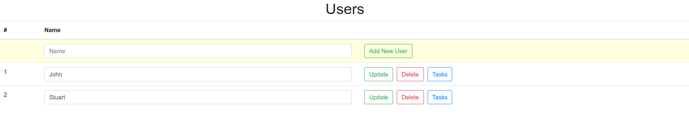
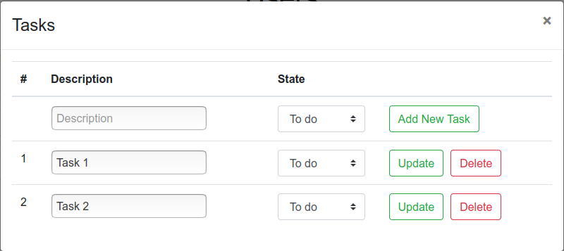

# ClientToDo

This angular web application allow manage users an their tasks throuhg the [to do API](https://github.com/aborgesrodrigues/to_do_api). The functionalities of the application are:
- Include/View/Update/Delete user data


- Include/View/Update/Delete task data


It is possible to see this project deployed in the [Heroku server](https://client-to-do-alessandro.herokuapp.com/).

To set the location of where the API is deployed change the **apiRoot** variable in the **api.service.ts file**.

Requirements
============

Install the `npm` packages described in the `package.json` and verify that it works:

```shell
npm install
npm start
```
